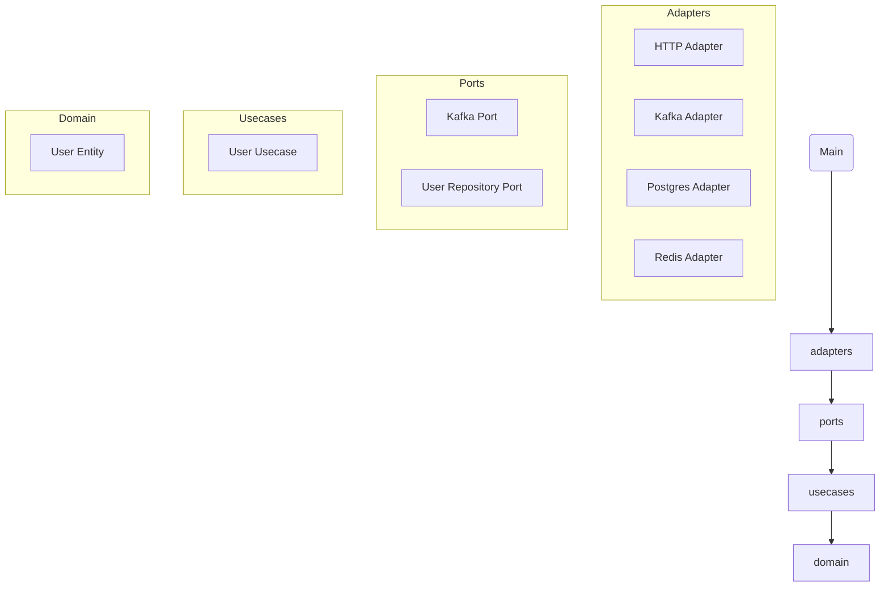

# 📐 Hexagonal Architecture Standards (Ports & Adapters) for Go Microservices

## 📝 Overview

The **Hexagonal Architecture** (also known as **Ports & Adapters**) promotes a clean separation between business logic and external systems. It ensures the core of our services is independent of frameworks, databases, and protocols.

We adopt this architecture to:

✅ Achieve **high testability** with pure business logic.  
✅ Enable **easy swapping of external technologies** (databases, APIs, message brokers).  
✅ Promote **clear boundaries** between layers for maintainability across teams.  
✅ Foster **consistent project structures** in a multinational organization.

This document defines mandatory conventions, folder responsibilities, coding rules, anti-patterns, and enforcement strategies for all Go microservices.

---

## 📂 Folder Responsibilities

| Folder                  | Responsibility                                                                                  |
|-------------------------|--------------------------------------------------------------------------------------------------|
| `/cmd`                  | Composition root. Wire dependencies and start the application.                                  |
| `/config`               | Application configuration (e.g., env, logging).                                                 |
| `/internal/adapters`    | Concrete implementations of ports to interact with external systems (HTTP, DB, Kafka, etc.).    |
| `/internal/domain`      | Pure domain models and business rules. No dependencies on external packages.                    |
| `/internal/ports`       | Interfaces defining contracts for external systems (inbound/outbound ports).                    |
| `/internal/usecase`     | Application business logic orchestrating domain and ports. No infrastructural logic.            |

---

## ✅ Ruleset

### 1️⃣ Domain Layer (`/internal/domain`)

| Rule                                                                                          |
|-----------------------------------------------------------------------------------------------|
| Only contains **entities**, **value objects**, and **domain services**.                       |
| Must **not import** any external library (including frameworks, ORMs, etc.).                  |
| Must remain **framework-agnostic** and **technology-agnostic**.                               |

✅ **Good Example**
```go
// internal/domain/user.go
package domain

type User struct {
    ID    string
    Email string
    Hash  string
}

func (u *User) ChangeEmail(newEmail string) {
    u.Email = newEmail
}
```

❌ **Bad Example**
```go
// internal/domain/user.go
package domain

import "gorm.io/gorm" // 🚨 Wrong: external dependency in domain

type User struct {
    gorm.Model
    Email string
}
```

---

### 2️⃣ Ports Layer (`/internal/ports`)

| Rule                                                                                  |
|---------------------------------------------------------------------------------------|
| Defines **interfaces** (contracts) for adapters (repositories, services, brokers).    |
| Interfaces must be **pure** and have no logic.                                        |
| Do not import any package from adapters or infrastructure.                            |

✅ **Good Example**
```go
// internal/ports/user_repository.go
package ports

import "context"
import "github.com/your-org/auth/internal/domain"

type UserRepository interface {
    Save(ctx context.Context, user *domain.User) error
    FindByID(ctx context.Context, id string) (*domain.User, error)
}
```

❌ **Bad Example**
```go
// internal/ports/user_repository.go
package ports

import "gorm.io/gorm" // 🚨 Wrong: coupling with ORM

type UserRepository interface {
    Save(db *gorm.DB, user *User) error // 🚨 Wrong: domain model replaced with DB struct
}
```

---

### 3️⃣ Usecase Layer (`/internal/usecase`)

| Rule                                                                                          |
|-----------------------------------------------------------------------------------------------|
| Contains **application services** orchestrating domain logic and ports.                       |
| Must not perform **IO**, **serialization**, or **infra-related logic**.                       |
| Allowed to depend on `domain` and `ports` only.                                               |

✅ **Good Example**
```go
// internal/usecase/user_usecase.go
package usecase

import (
    "context"

    "github.com/your-org/auth/internal/domain"
    "github.com/your-org/auth/internal/ports"
)

type UserUsecase struct {
    repo ports.UserRepository
}

func NewUserUsecase(repo ports.User.UserRepository) *UserUsecase {
    return &UserUsecase{repo: repo}
}

func (u *UserUsecase) RegisterUser(ctx context.Context, email, hash string) error {
    user := &domain.User{Email: email, Hash: hash}
    return u.repo.Save(ctx, user)
}
```

❌ **Bad Example**
```go
// internal/usecase/user_usecase.go
package usecase

import (
    "context"
    "gorm.io/gorm" // 🚨 Wrong: infrastructure dependency
)

func RegisterUser(ctx context.Context, db *gorm.DB, email string) error {
    // 🚨 Wrong: DB logic in usecase
    return db.Create(&User{Email: email}).Error
}
```

---

### 4️⃣ Adapters Layer (`/internal/adapters`)

| Rule                                                                                          |
|-----------------------------------------------------------------------------------------------|
| Implements `ports` interfaces to interact with external systems.                              |
| Must contain no business logic – only **translation and delegation**.                         |
| Adapter code must remain **thin** and **focused on a single external system**.                |

✅ **Good Example**
```go
// internal/adapters/postgres/user_repository.go
package postgres

import (
    "context"

    "github.com/your-org/auth/internal/domain"
    "github.com/your-org/auth/internal/ports"
    "gorm.io/gorm"
)

type UserRepository struct {
    db *gorm.DB
}

func NewUserRepository(db *gorm.DB) ports.UserRepository {
    return &UserRepository{db: db}
}

func (r *UserRepository) Save(ctx context.Context, user *domain.User) error {
    return r.db.WithContext(ctx).Create(user).Error
}
```

❌ **Bad Example**
```go
// internal/adapters/postgres/user_repository.go
package postgres

func RegisterUser(email string) error {
    // 🚨 Wrong: business logic inside adapter
    if email == "" {
        return errors.New("email required")
    }
    return db.Exec("INSERT INTO users ...").Error
}
```

---

### 5️⃣ Cmd Layer (`/cmd`)

| Rule                                                                                          |
|-----------------------------------------------------------------------------------------------|
| Acts as the **composition root**: wiring dependencies and starting services.                  |
| No business logic allowed.                                                                    |
| Imports and connects adapters, usecases, and configuration.                                   |

✅ **Good Example**
```go
// cmd/main.go
package main

import (
    "github.com/your-org/auth/config"
    "github.com/your-org/auth/internal/adapters/postgres"
    "github.com/your-org/auth/internal/usecase"
)

func main() {
    cfg := config.Load()
    db := config.InitDB(cfg)

    userRepo := postgres.NewUserRepository(db)
    userUC := usecase.NewUserUsecase(userRepo)

    server := NewHTTPServer(userUC)
    server.Start()
}
```

❌ **Bad Example**
```go
// cmd/main.go
package main

func main() {
    // 🚨 Wrong: DB queries directly in main
    db.Exec("CREATE TABLE users ...")
}
```

---

## 🛑 Common Anti-Patterns

| Anti-Pattern                          | Why to Avoid                                                       |
|---------------------------------------|---------------------------------------------------------------------|
| Business logic in adapters            | Violates separation of concerns.                                   |
| Framework code leaking into domain    | Reduces portability and testability.                               |
| Domain objects tied to ORM structs    | Tight coupling makes switching DBs hard.                           |
| Usecases doing IO or HTTP calls       | Breaks clean architecture boundaries.                              |
| Global state in domain or usecases    | Hard to test and debug.                                            |

---

## ✅ Summary Checklist

| Layer     | Validation                                                                                  |
|-----------|----------------------------------------------------------------------------------------------|
| Domain    | No external dependencies, pure Go types only.                                               |
| Ports     | Interfaces only, no logic, no infra imports.                                                |
| Usecase   | Orchestration only, no IO or external system calls.                                         |
| Adapters  | Thin, focused implementations of ports.                                                     |
| Cmd       | Composition root: wires dependencies, no business logic.                                    |

---

## 🛠 Enforcement Suggestions

To ensure compliance, adopt these tools:

- **golangci-lint**: Enforce architectural rules (e.g., forbid infra imports in `domain`).
- **Staticcheck**: Detect unintended dependencies.
- **go mod tidy**: Ensure minimal dependencies.
- **Custom linters**: e.g., block `gorm`, `net/http` in domain/usecase.

Example golangci-lint config:
```yaml
linters-settings:
  forbidigo:
    forbidden-texts:
      - "gorm.io" # forbid ORM in domain/usecase
      - "net/http"
```

---

## 📊 Mermaid Architecture Diagram


